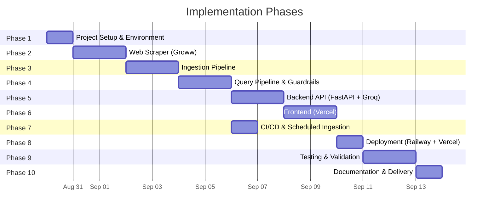
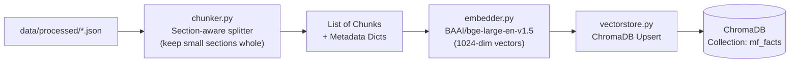
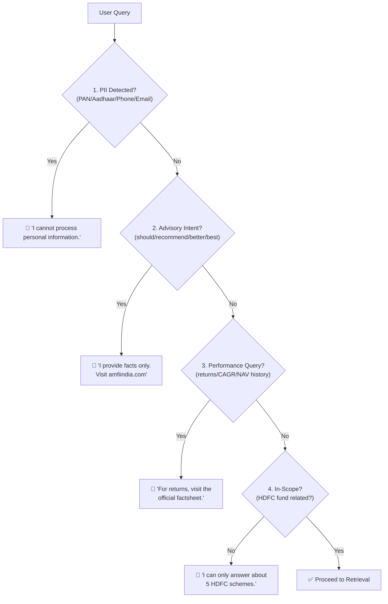
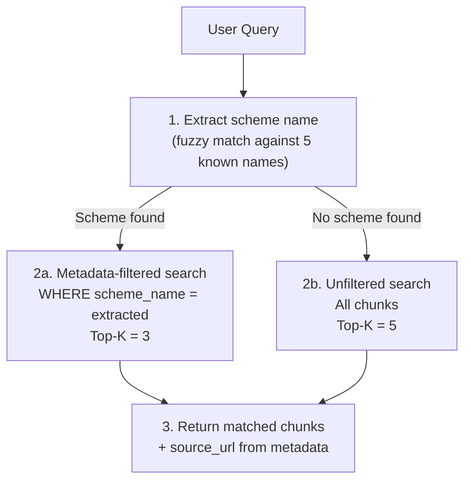
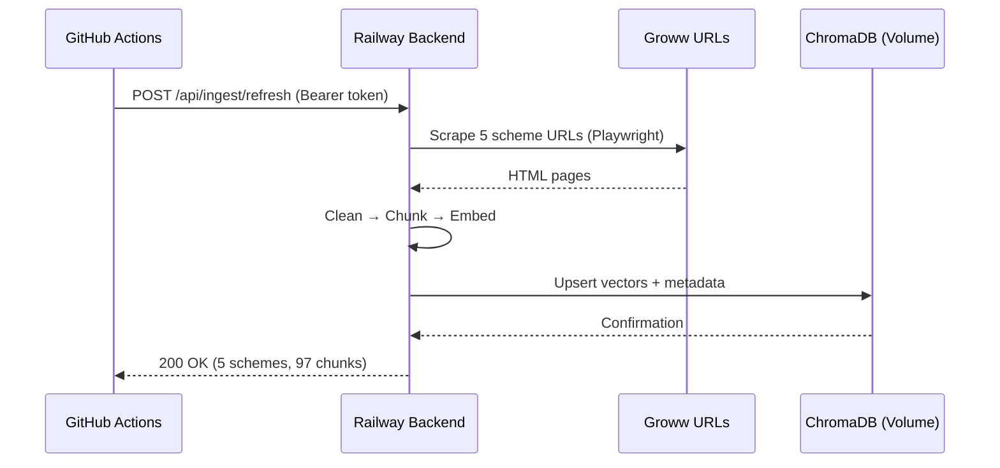
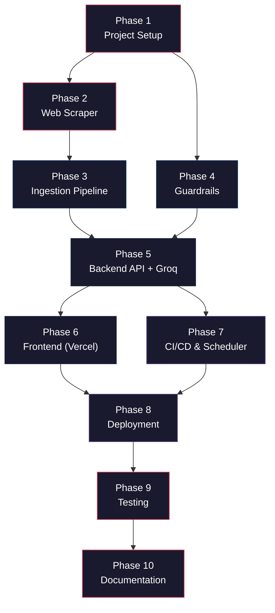

# Implementation Plan: Mutual Fund FAQ Assistant

> **References**:
> - [problemStatement.md](file:///Users/gkondave/Documents/Python/Agents/Antigravity/RAG-Chatbot/docs/problemStatement.md)
> - [architecture.md](file:///Users/gkondave/Documents/Python/Agents/Antigravity/RAG-Chatbot/docs/architecture.md)

---

## Phase Overview



| Phase | Name | Duration | Key Output |
|-------|------|----------|------------|
| 1 | Project Setup & Environment | 1 day | Repo structure, venv, dependencies, `.env`, local dev ready |
| 2 | Web Scraper (Groww) | 2 days | Scraped data from 5 HDFC fund URLs |
| 3 | Ingestion Pipeline | 2 days | Chunked, embedded, and stored vectors in ChromaDB |
| 4 | Query Pipeline & Guardrails | 2 days | Retrieval + guardrails (PII, advisory, scope) |
| 5 | Backend API (FastAPI + Groq) | 2 days | FastAPI server with query + ingest endpoints + Groq LLM |
| 6 | Frontend (Chat UI) | 2 days | HTML/CSS/JS chat UI calling backend API |
| 7 | CI/CD & Scheduled Ingestion | 1 day | GitHub Actions workflow for daily 10 AM IST refresh |
| 8 | Local Verification & Deployment | 1 day | Verified locally on Mac, then deployed to Railway + Vercel |
| 9 | Testing & Validation | 2 days | Unit tests, API tests, integration tests, edge cases |
| 10 | Documentation & Delivery | 1 day | README, deployment.md, final docs, demo |

**Total Estimated Duration: ~16 days**

---

## Phase 1: Project Setup & Environment

### 1.1 Objective

Bootstrap the project repository, establish the directory structure (backend + frontend split), configure the Python environment, create Railway & Vercel projects, and set up all dependencies.

### 1.2 Tasks

| # | Task | File(s) / Action | Status |
|---|------|-------------------|--------|
| 1.1 | Create project directory structure | All directories as per architecture | `[x]` |
| 1.2 | Initialize Python virtual environment | `python3 -m venv .venv` | `[x]` |
| 1.3 | Create `requirements.txt` with pinned dependencies | `backend/requirements.txt` | `[x]` |
| 1.4 | Install all dependencies | `pip install -r backend/requirements.txt` | `[x]` |
| 1.5 | Install Playwright browsers | `playwright install chromium` | `[x]` |
| 1.6 | Create `.env.example` with all config variables | `.env.example` | `[x]` |
| 1.7 | Create `.env` from `.env.example` (fill in GROQ_API_KEY, INGEST_API_KEY) | `.env` (gitignored) | `[x]` |
| 1.8 | Create `.gitignore` | `.gitignore` | `[x]` |
| 1.9 | Create all `__init__.py` files | `backend/src/` and all subpackages | `[x]` |
| 1.10 | Verify Groq API connectivity | Quick test script | `[x]` |
| 1.11 | Initialize Git repo and make first commit | `git init && git add . && git commit` | `[x]` |

> **Note**: Railway and Vercel project creation is deferred to Phase 8 (Deployment). During development, everything runs locally on your Mac.

### 1.3 Directory Structure to Create

```
RAG-Chatbot/
├── .github/
│   └── workflows/
│       └── scheduled-ingestion.yml
├── docs/
│   ├── problemStatement.md
│   ├── problemStatement.txt
│   ├── architecture.md
│   └── implementation-plan.md
├── backend/
│   ├── src/
│   │   ├── __init__.py
│   │   ├── main.py
│   │   ├── config.py
│   │   ├── scraper/
│   │   │   ├── __init__.py
│   │   │   ├── groww_scraper.py
│   │   │   └── content_cleaner.py
│   │   ├── ingestion/
│   │   │   ├── __init__.py
│   │   │   ├── chunker.py
│   │   │   ├── embedder.py
│   │   │   └── vectorstore.py
│   │   ├── pipeline/
│   │   │   ├── __init__.py
│   │   │   ├── guardrails.py
│   │   │   ├── retriever.py
│   │   │   ├── prompt_builder.py
│   │   │   ├── llm_client.py
│   │   │   └── response_formatter.py
│   │   └── api/
│   │       ├── __init__.py
│   │       └── routes.py
│   ├── data/
│   │   ├── raw/
│   │   ├── processed/
│   │   └── chroma_db/
│   ├── tests/
│   │   ├── test_guardrails.py
│   │   ├── test_retriever.py
│   │   ├── test_formatter.py
│   │   └── test_api.py
│   ├── requirements.txt
│   ├── Procfile
│   └── railway.toml
├── frontend/
│   ├── index.html
│   ├── css/
│   │   └── style.css
│   ├── js/
│   │   └── app.js
│   └── vercel.json
├── .env.example
├── .gitignore
└── README.md
```

### 1.4 Dependencies (`backend/requirements.txt`)

```
fastapi>=0.115.0
uvicorn[standard]>=0.30.0
langchain>=0.3.0
langchain-groq>=0.2.0
langchain-community>=0.3.0
chromadb>=0.5.0
sentence-transformers>=3.0.0
playwright>=1.45.0
beautifulsoup4>=4.12.0
python-dotenv>=1.0.0
httpx>=0.27.0
```

### 1.5 Environment Variables (`.env.example`)

```env
# Groq LLM
GROQ_API_KEY=gsk_xxxxxxxxxxxxxxxxxxxx
GROQ_MODEL=openai/gpt-oss-120b

# ChromaDB
CHROMA_PERSIST_DIR=./backend/data/chroma_db

# Embeddings
EMBEDDING_MODEL=BAAI/bge-large-en-v1.5

# Chunking
CHUNK_SIZE=500
CHUNK_OVERLAP=50

# Retrieval
TOP_K=3
SIMILARITY_THRESHOLD=0.35

# API Security
INGEST_API_KEY=sk_ingest_xxxxxxxxxxxx

# CORS
ALLOWED_ORIGINS=http://localhost:5500,http://localhost:3000,http://127.0.0.1:5500
```

> **Tip**: For local development, the `.env` file uses `./backend/data/chroma_db` for `CHROMA_PERSIST_DIR`. On Railway, this changes to `/data/chroma_db` (persistent volume mount).

### 1.6 Acceptance Criteria

- [ ] `pip install -r backend/requirements.txt` completes without errors
- [ ] `playwright install chromium` succeeds
- [ ] Groq API test call returns a valid response
- [ ] All directories and `__init__.py` files exist
- [ ] `.env` is listed in `.gitignore`
- [ ] `.env` file created with valid `GROQ_API_KEY`
- [ ] Git repo initialized with first commit

---

## Phase 2: Web Scraper (Groww)

### 2.1 Objective

Build a Playwright-based scraper that navigates each of the 5 Groww HDFC mutual fund pages, waits for JS rendering, and extracts structured section data.

### 2.2 Target URLs

| # | Scheme | URL |
|---|--------|-----|
| 1 | HDFC Mid Cap Fund | `https://groww.in/mutual-funds/hdfc-mid-cap-fund-direct-growth` |
| 2 | HDFC Small Cap Fund | `https://groww.in/mutual-funds/hdfc-small-cap-fund-direct-growth` |
| 3 | HDFC Gold ETF FoF | `https://groww.in/mutual-funds/hdfc-gold-etf-fund-of-fund-direct-plan-growth` |
| 4 | HDFC Large Cap Fund | `https://groww.in/mutual-funds/hdfc-large-cap-fund-direct-growth` |
| 5 | HDFC ELSS Tax Saver Fund | `https://groww.in/mutual-funds/hdfc-elss-tax-saver-fund-direct-plan-growth` |

### 2.3 Tasks

| # | Task | File(s) | Status |
|---|------|---------|--------|
| 2.1 | Implement Playwright scraper for single URL | `backend/src/scraper/groww_scraper.py` | `[x]` |
| 2.2 | Inspect Groww page DOM to identify CSS selectors for each section | Manual exploration | `[x]` |
| 2.3 | Extract structured data: Fund Overview, Fund Details, NAV & AUM, Tax Info | `backend/src/scraper/groww_scraper.py` | `[x]` |
| 2.4 | Implement content cleaner (strip nav, ads, modals, normalize whitespace) | `backend/src/scraper/content_cleaner.py` | `[x]` |
| 2.5 | Add PII scrubbing to cleaner (regex for PAN, Aadhaar, phone, email) | `backend/src/scraper/content_cleaner.py` | `[x]` |
| 2.6 | Add metadata attachment (source_url, scrape_date, scheme_name, section) | `backend/src/scraper/groww_scraper.py` | `[x]` |
| 2.7 | Create callable scraper function (to be used by API ingest endpoint) | `backend/src/scraper/groww_scraper.py` | `[x]` |
| 2.8 | Save raw HTML to `data/raw/` and cleaned JSON to `data/processed/` | `backend/src/scraper/groww_scraper.py` | `[x]` |
| 2.9 | Test scraper against all 5 URLs; verify output completeness | Manual verification | `[x]` |

### 2.4 Scraper Output Schema

Each scheme produces a JSON file in `backend/data/processed/`:

```json
{
  "scheme_name": "HDFC Mid Cap Fund",
  "source_url": "https://groww.in/mutual-funds/hdfc-mid-cap-fund-direct-growth",
  "scrape_date": "2026-08-30",
  "sections": [
    {
      "section_name": "Fund Overview",
      "content": "HDFC Mid Cap Fund Direct Growth is a mid-cap equity fund...",
      "data_points": {
        "category": "Equity - Mid Cap",
        "amc": "HDFC Asset Management Company",
        "fund_manager": "..."
      }
    },
    {
      "section_name": "Fund Details",
      "content": "Expense Ratio: 0.75%. Exit Load: 1% if redeemed within 1 year...",
      "data_points": {
        "expense_ratio": "0.75%",
        "exit_load": "1% if redeemed within 1 year",
        "min_sip": "₹500",
        "min_lumpsum": "₹5,000",
        "benchmark": "NIFTY Midcap 150 TRI",
        "riskometer": "Very High"
      }
    }
  ]
}
```

### 2.5 Key Design Decisions

| Decision | Rationale |
|----------|-----------|
| Use Playwright over Requests/Selenium | Groww pages are heavily JS-rendered; Playwright is faster and more reliable than Selenium |
| Save raw HTML alongside cleaned data | Enables re-processing without re-scraping if cleaning logic changes |
| Section-level granularity | Preserves logical grouping for better chunk quality downstream |
| Tag performance sections as non-answerable | Compliance with "no performance comparisons" constraint |
| Callable function (not just CLI script) | Allows the FastAPI ingest endpoint to call scraper directly |

### 2.6 Acceptance Criteria

- [ ] All 5 URLs are scraped successfully
- [ ] Raw HTML saved in `backend/data/raw/<scheme-slug>.html`
- [ ] Cleaned JSON saved in `backend/data/processed/<scheme-slug>.json`
- [ ] Each JSON contains ≥ 4 sections with non-empty content
- [ ] No PII exists in cleaned output
- [ ] `scrape_date` and `source_url` present in every record

---

## Phase 3: Ingestion Pipeline

### 3.1 Objective

Read the cleaned JSON data, chunk it into semantically meaningful pieces, generate embeddings with BGE-large-en-v1.5, and store vectors + metadata in ChromaDB.

### 3.2 Tasks

| # | Task | File(s) | Status |
|---|------|---------|--------|
| 3.1 | Implement text chunker with `RecursiveCharacterTextSplitter` | `backend/src/ingestion/chunker.py` | `[x]` |
| 3.2 | Configure chunk size (500 chars) and overlap (50 chars) | `backend/src/ingestion/chunker.py` | `[x]` |
| 3.3 | Attach metadata to each chunk: `scheme_name`, `section`, `source_url`, `scrape_date` | `backend/src/ingestion/chunker.py` | `[x]` |
| 3.4 | Implement embedding wrapper using `langchain_google_genai.GoogleGenerativeAIEmbeddings` | `backend/src/ingestion/embedder.py` | `[x]` |
| 3.5 | Configure Gemini `models/embedding-001` model via GOOGLE_API_KEY | `backend/src/ingestion/embedder.py` | `[x]` |
| 3.6 | Implement ChromaDB collection manager (create, upsert, delete, reset) | `backend/src/ingestion/vectorstore.py` | `[x]` |
| 3.7 | Configure persistent storage at `$CHROMA_PERSIST_DIR` | `backend/src/ingestion/vectorstore.py` | `[x]` |
| 3.8 | Create full ingestion function: scrape → clean → chunk → embed → store | `backend/src/ingestion/` | `[x]` |
| 3.9 | Add re-ingestion support (clear collection + re-insert) | `backend/src/ingestion/vectorstore.py` | `[x]` |
| 3.10 | Validate stored chunk count and sample retrieval | Manual verification | `[x]` |

### 3.3 Ingestion Flow



### 3.4 Actual Data Profile (from scraped output)

> [!IMPORTANT]
> The actual scraped data is **much smaller** than originally estimated. The chunking strategy has been revised accordingly.

| Metric | Value |
|--------|-------|
| Total schemes scraped | 5 |
| Total sections across all schemes | 19 |
| Total characters (all sections) | ~4,800 |
| Average section size | ~252 chars |
| Largest section type | `Fund Overview` (~865 chars) |
| Smallest section type | `NAV & AUM` (~23 chars) |

**Section size breakdown:**

| Section Type | Count | Avg Chars | Range |
|-------------|-------|-----------|-------|
| Fund Overview | 4 (missing for Gold ETF FoF) | ~865 | 863–867 |
| Fund Details | 5 | ~76 | 76–78 |
| NAV & AUM | 5 | ~23 | 22–25 |
| Tax Info | 5 | ~169 | 153–173 |

### 3.5 Chunking Configuration (Revised)

| Parameter | Value | Rationale |
|-----------|-------|-----------|
| Strategy | **Section-aware**: keep sections ≤ 500 chars whole; split only sections > 500 chars | Most sections are very short (23–173 chars). Splitting them would destroy meaning. |
| Splitter (for large sections) | `RecursiveCharacterTextSplitter` | Only used for `Fund Overview` (~865 chars) |
| Chunk Size (when splitting) | 500 characters | Balances context window with granularity |
| Chunk Overlap (when splitting) | 50 characters | Maintains continuity across split boundaries |
| Separators | `["\n\n", "\n", ". ", " ", ""]` | Natural text boundaries |
| Metadata Fields | `scheme_name`, `section`, `source_url`, `scrape_date` | Carried from JSON into every chunk |

**Estimated chunk count:** ~23 chunks (15 small sections kept whole + ~8 chunks from splitting 4 Fund Overview sections)

> [!TIP]
> If more data sources are added in the future (more schemes, more section types, FAQ sections), the chunk count will grow naturally. The section-aware strategy scales well — small sections stay whole, large ones get split.

### 3.6 Embedding Configuration

| Parameter | Value |
|-----------|-------|
| Model | `BAAI/bge-large-en-v1.5` |
| Dimensions | 1024 |
| Batch Size | 32 (for bulk encoding) |
| Query Prefix | `"Represent this sentence for searching relevant passages: "` |
| Device | CPU (default) or CUDA if available |

> **Important**: BGE models recommend adding the prefix `"Represent this sentence for searching relevant passages: "` to **queries only** (not documents) for optimal retrieval.

### 3.7 ChromaDB Configuration

| Parameter | Value |
|-----------|-------|
| Collection Name | `mf_facts` |
| Persistence Directory | `$CHROMA_PERSIST_DIR` (`/data/chroma_db` on Railway) |
| Distance Metric | Cosine |
| ID Strategy | `{scheme_slug}_{section}_{chunk_index}` |

### 3.8 Acceptance Criteria

- [ ] Ingestion pipeline runs end-to-end without errors
- [ ] ChromaDB collection `mf_facts` contains ~19–30 chunks
- [ ] Small sections (≤ 500 chars) are stored as single whole chunks
- [ ] Large sections (> 500 chars, i.e. Fund Overview) are split with overlap
- [ ] Each chunk has `scheme_name`, `section`, `source_url`, `scrape_date` metadata
- [ ] Sample similarity query returns relevant results
- [ ] Re-ingestion (clear + re-insert) works correctly
- [ ] Embedding model loads and encodes without errors

---

## Phase 4: Query Pipeline & Guardrails

### 4.1 Objective

Build the runtime query pipeline: guardrail filters (PII, advisory, scope), semantic retrieval from ChromaDB, and metadata-filtered search.

### 4.2 Tasks

| # | Task | File(s) | Status |
|---|------|---------|--------|
| 4.1 | Implement PII detection (PAN, Aadhaar, phone, email regex) | `backend/src/pipeline/guardrails.py` | `[ ]` |
| 4.2 | Implement advisory intent detection (keyword matching) | `backend/src/pipeline/guardrails.py` | `[ ]` |
| 4.3 | Implement scope check (is query about HDFC mutual funds?) | `backend/src/pipeline/guardrails.py` | `[ ]` |
| 4.4 | Implement performance query detection | `backend/src/pipeline/guardrails.py` | `[ ]` |
| 4.5 | Create refusal response templates for each category | `backend/src/pipeline/guardrails.py` | `[ ]` |
| 4.6 | Implement retriever with similarity search (top-k=3, threshold=0.35) | `backend/src/pipeline/retriever.py` | `[ ]` |
| 4.7 | Add optional metadata filtering (by `scheme_name` when mentioned) | `backend/src/pipeline/retriever.py` | `[ ]` |
| 4.8 | Implement scheme name extraction from user query | `backend/src/pipeline/retriever.py` | `[ ]` |
| 4.9 | Integrate guardrails → retriever in a single query handler | `backend/src/pipeline/retriever.py` | `[ ]` |

### 4.3 Guardrail Decision Flow



### 4.4 PII Detection Patterns

```python
PII_PATTERNS = {
    "PAN":     r"[A-Z]{5}[0-9]{4}[A-Z]",
    "Aadhaar": r"\b\d{4}\s?\d{4}\s?\d{4}\b",
    "Phone":   r"\b[6-9]\d{9}\b",
    "Email":   r"\b[\w.-]+@[\w.-]+\.\w+\b",
}
```

### 4.5 Advisory Detection Keywords

```python
ADVISORY_KEYWORDS = [
    "should", "recommend", "suggest", "better", "best",
    "compare returns", "which fund", "invest in",
    "buy", "sell", "hold", "prediction", "forecast",
]
```

### 4.6 Refusal Response Templates

| Category | Template |
|----------|----------|
| **PII** | "I cannot process personal or sensitive information. Please do not share PII such as PAN, Aadhaar, or account numbers." |
| **Advisory** | "I'm a facts-only assistant and cannot provide investment advice or recommendations. For investment guidance, please visit [AMFI Investor Corner](https://www.amfiindia.com/investor-corner/knowledge-center)." |
| **Performance** | "I don't provide performance data or return calculations. For the latest returns, please refer to the official factsheet at {source_url}." |
| **Out of Scope** | "I can only answer factual questions about the 5 HDFC mutual fund schemes in my database. Please rephrase or visit [Groww](https://groww.in/mutual-funds) for other funds." |

### 4.7 Retrieval Strategy (Data-Informed)

> [!IMPORTANT]
> The retrieval strategy has been revised based on analysis of the actual scraped data. The original plan assumed ~100 diverse chunks. In reality, we have **19 sections** with critical characteristics that demand a different approach.

#### Problems discovered with pure cosine similarity search

| Problem | Evidence | Impact |
|---------|----------|--------|
| **Tiny chunks** | 10 of 19 chunks are < 100 chars (5 are < 50 chars). `NAV & AUM` is just `"NAV: 28 Aug '26\n₹237.07"` (23 chars). | Short texts embed poorly — cosine distances collapse, all Fund Details chunks score ~equally for any "expense ratio" query regardless of scheme. |
| **Near-duplicate Tax Info** | 4 of 5 Tax Info sections are **identical** (`"If you redeem within one year…"`). Only Gold ETF FoF differs. | A query like *"tax on HDFC Small Cap"* may return HDFC Large Cap's Tax Info — wrong scheme, right content. |
| **Cross-scheme keyword overlap** | All Fund Details sections contain "Min. for SIP", "Expense ratio", "AUM". All Fund Overview sections contain "Minimum SIP Investment", "exit load". | Without metadata filtering, the top-3 results for *"expense ratio of HDFC Mid Cap"* include 4 other schemes. |

#### Revised retrieval approach: **Metadata-first + semantic fallback**



#### Retrieval Configuration

| Parameter | Value | Rationale |
|-----------|-------|-----------|
| **Strategy** | Metadata-first (scheme_name filter) + semantic fallback | With only 19 chunks and heavy cross-scheme duplication, metadata filtering is **mandatory**, not optional. |
| **Scheme extraction** | Fuzzy match query against 5 known scheme names | Handles variations like "HDFC mid cap", "midcap fund", "ELSS tax saver" |
| **Top-K (filtered)** | 3 | When filtered to a single scheme, there are only 3–4 sections. Top-3 covers all. |
| **Top-K (unfiltered)** | 5 | For generic queries without a scheme name, cast a wider net across all 19 chunks. |
| **Score Threshold** | None (removed) | With very short chunks, absolute cosine scores are unreliable. Instead, rely on metadata filtering + LLM judgment. |
| **Distance Metric** | Cosine | Unchanged. |
| **Query Prefix** | `"Represent this sentence for searching relevant passages: "` | Required by BGE-large model for queries. |

#### Scheme name extraction strategy

```python
SCHEME_ALIASES = {
    "HDFC Mid Cap Fund": ["hdfc mid cap", "mid cap fund", "midcap"],
    "HDFC Small Cap Fund": ["hdfc small cap", "small cap fund", "smallcap"],
    "HDFC Gold ETF FoF": ["hdfc gold", "gold etf", "gold fund"],
    "HDFC Large Cap Fund": ["hdfc large cap", "large cap fund", "largecap"],
    "HDFC ELSS Tax Saver Fund": ["hdfc elss", "tax saver", "elss fund"],
}
```

> [!TIP]
> When a scheme name IS extracted, the retriever filters to that scheme's chunks only (3–4 results max). When NO scheme name is found, the query runs unfiltered across all 19 chunks. This is the single most important design decision — it prevents the "wrong scheme, right content" problem.

### 4.8 Acceptance Criteria

- [ ] PII queries (containing PAN/Aadhaar/phone/email) are refused
- [ ] Advisory queries ("Should I invest?", "Which is better?") are refused
- [ ] Performance queries ("What are the returns?") are refused with factsheet link
- [ ] Out-of-scope queries get polite refusal
- [ ] Valid factual queries retrieve relevant chunks from **correct** scheme
- [ ] Scheme name extraction correctly identifies all 5 schemes from natural language variations
- [ ] Metadata filter correctly narrows results when fund name is mentioned
- [ ] Queries mentioning a scheme return chunks ONLY from that scheme (no cross-scheme leakage)
- [ ] Queries without a scheme name return results from the most semantically relevant scheme(s)
- [ ] Near-duplicate Tax Info sections resolve to the correct scheme via metadata filter

---

## Phase 5: Backend API (FastAPI) [Completed]

### 5.1 Objective

Build the FastAPI server with query and ingestion endpoints, integrate Groq LLM (`openai/gpt-oss-120b`), implement the facts-only system prompt, and build the response formatter that enforces the 3-sentence + 1-citation + footer contract (Updated: 2026-08-30).

### 5.2 Tasks

| # | Task | File(s) | Status |
|---|------|---------|--------|
| 5.1 | Create FastAPI app with lifespan events (load model on startup) | `backend/src/main.py` | `[ ]` |
| 5.2 | Create config module (load env vars with defaults) | `backend/src/config.py` | `[ ]` |
| 5.3 | Implement `POST /api/query` endpoint | `backend/src/api/routes.py` | `[ ]` |
| 5.4 | Implement `POST /api/ingest/refresh` endpoint (with Bearer auth) | `backend/src/api/routes.py` | `[ ]` |
| 5.5 | Implement `GET /api/health` endpoint | `backend/src/api/routes.py` | `[ ]` |
| 5.6 | Implement `GET /api/status` endpoint (last ingest date, chunk count) | `backend/src/api/routes.py` | `[ ]` |
| 5.7 | Configure CORS middleware (allow Vercel origin + localhost) | `backend/src/main.py` | `[ ]` |
| 5.8 | Implement Groq API client wrapper (using `langchain-groq`) | `backend/src/pipeline/llm_client.py` | `[ ]` |
| 5.9 | Configure: model=`openai/gpt-oss-120b`, temperature=0.0, max_tokens=256 | `backend/src/pipeline/llm_client.py` | `[ ]` |
| 5.10 | Implement system prompt builder with context injection | `backend/src/pipeline/prompt_builder.py` | `[ ]` |
| 5.11 | Implement response formatter: 3-sentence truncation | `backend/src/pipeline/response_formatter.py` | `[ ]` |
| 5.12 | Implement response formatter: citation URL extraction/injection | `backend/src/pipeline/response_formatter.py` | `[ ]` |
| 5.13 | Implement response formatter: footer appender | `backend/src/pipeline/response_formatter.py` | `[ ]` |
| 5.14 | Wire pipeline: guardrails → retriever → prompt → LLM → formatter | `backend/src/api/routes.py` | `[ ]` |
| 5.15 | Create `Procfile` and `railway.toml` | `backend/Procfile`, `backend/railway.toml` | `[ ]` |
| 5.16 | Test locally: `cd backend && uvicorn src.main:app --reload --port 8000` | Manual verification | `[ ]` |
| 5.17 | Verify local health check: `curl http://localhost:8000/api/health` | Manual verification | `[ ]` |

### 5.3 API Endpoints

| Method | Endpoint | Description | Auth |
|--------|----------|-------------|------|
| `POST` | `/api/query` | Accept user query, return factual answer | Public (CORS-restricted) |
| `POST` | `/api/ingest/refresh` | Trigger full re-ingestion pipeline | Bearer token (`INGEST_API_KEY`) |
| `GET` | `/api/health` | Health check (DB status, model loaded) | Public |
| `GET` | `/api/status` | Last ingestion date, chunk count | Public |

### 5.4 Request / Response Schemas

**Query** — `POST /api/query`

```json
// Request
{ "query": "What is the expense ratio of HDFC Mid Cap Fund?" }

// Response (200 OK)
{
  "answer": "The expense ratio of HDFC Mid Cap Fund (Direct Growth) is 0.75%.",
  "source_url": "https://groww.in/mutual-funds/hdfc-mid-cap-fund-direct-growth",
  "last_updated": "2026-08-30",
  "refused": false
}

// Response (200 OK — Refusal)
{
  "answer": "I'm a facts-only assistant and cannot provide investment advice...",
  "source_url": null,
  "last_updated": null,
  "refused": true,
  "refusal_category": "advisory"
}
```

**Ingest** — `POST /api/ingest/refresh`

```json
// Response (200 OK)
{
  "status": "success",
  "schemes_scraped": 5,
  "chunks_stored": 97,
  "scrape_date": "2026-08-30"
}
```

### 5.5 Groq LLM Configuration

| Parameter | Value |
|-----------|-------|
| Provider | Groq Cloud API |
| Model | `openai/gpt-oss-120b` |
| Temperature | 0.0 |
| Max Tokens | 256 |
| API Key Source | `GROQ_API_KEY` env var |
| Timeout | 30 seconds |
| Retry | 2 retries with exponential backoff |

### 5.6 System Prompt

```text
You are a facts-only mutual fund FAQ assistant for HDFC mutual fund schemes
available on Groww. You must follow these rules strictly:

RULES:
1. Answer ONLY using the provided context. Do NOT use prior knowledge.
2. Respond in a MAXIMUM of 3 sentences.
3. Include EXACTLY ONE source citation URL from the context metadata.
4. Append this footer to every response:
   "Last updated from sources: {scrape_date}"
5. If the context does not contain the answer, respond:
   "I don't have this information in my current data. Please visit
   {source_url} for the latest details."
6. NEVER provide investment advice, opinions, recommendations, or
   performance comparisons.
7. If the user asks for advice or comparisons, politely refuse and direct
   them to https://www.amfiindia.com/investor-corner/knowledge-center
```

### 5.7 Response Format Contract

```
[Factual answer in ≤ 3 sentences]

🔗 Source: {source_url}
📅 Last updated from sources: {scrape_date}
```

### 5.8 Railway Configuration

**`backend/Procfile`**:
```
web: uvicorn src.main:app --host 0.0.0.0 --port $PORT
```

**`backend/railway.toml`**:
```toml
[build]
builder = "nixpacks"

[deploy]
startCommand = "playwright install-deps chromium && playwright install chromium && uvicorn src.main:app --host 0.0.0.0 --port $PORT"
restartPolicyType = "ON_FAILURE"
restartPolicyMaxRetries = 3

[[volumes]]
mount = "/data"
```

### 5.9 Acceptance Criteria

- [ ] FastAPI server starts with `uvicorn src.main:app --reload`
- [ ] `POST /api/query` returns valid JSON responses
- [ ] `POST /api/ingest/refresh` triggers full pipeline with auth
- [ ] `GET /api/health` returns healthy status
- [ ] Unauthorized ingest requests return 401
- [ ] CORS allows Vercel domain and blocks others
- [ ] Groq API call succeeds with `openai/gpt-oss-120b`
- [ ] Responses contain ≤ 3 sentences, 1 citation, footer
- [ ] Temperature=0.0 produces deterministic outputs

---

## Phase 6: Frontend (Chat UI)

### 6.1 Objective

Build a minimal, clean chat interface using HTML/CSS/JavaScript. The frontend calls the backend API for all queries. It runs locally first and is deployed to Vercel later in Phase 8.

### 6.2 Tasks

| # | Task | File(s) | Status |
|---|------|---------|--------|
| 6.1 | Create main HTML page with chat structure | `frontend/index.html` | `[x]` |
| 6.2 | Implement chat CSS (message bubbles, layout, responsive) | `frontend/css/style.css` | `[x]` |
| 6.3 | Add persistent disclaimer banner: "Facts-only. No investment advice." | `frontend/index.html` | `[x]` |
| 6.4 | Add welcome message in chat area | `frontend/js/app.js` | `[x]` |
| 6.5 | Add 3 example question buttons (clickable quick-prompts) | `frontend/index.html` | `[x]` |
| 6.6 | Implement chat input with send button + Enter key support | `frontend/js/app.js` | `[x]` |
| 6.7 | Implement API client (`fetch` to Railway backend `POST /api/query`) | `frontend/js/app.js` | `[x]` |
| 6.8 | Render user messages (right-aligned bubble) | `frontend/js/app.js` | `[x]` |
| 6.9 | Render assistant messages (left-aligned bubble with source + footer) | `frontend/js/app.js` | `[x]` |
| 6.10 | Add typing indicator / loading spinner during API calls | `frontend/js/app.js` | `[x]` |
| 6.11 | Format source links as clickable `<a>` tags in responses | `frontend/js/app.js` | `[x]` |
| 6.12 | Handle errors (network failure, backend unavailable) | `frontend/js/app.js` | `[x]` |
| 6.13 | Create Vercel config | `frontend/vercel.json` | `[x]` |
| 6.14 | Test locally with `python3 -m http.server 5500` (from `frontend/` dir) | Manual | `[x]` |
| 6.15 | Test locally with VS Code Live Server (port 5500) | Manual | `[x]` |
| 6.16 | Verify end-to-end locally: frontend → backend → Groq → response | Manual | `[x]` |

### 6.3 UI Wireframe

```
┌──────────────────────────────────────────────────┐
│  🏦 Mutual Fund FAQ Assistant                    │
│  ─────────────────────────────────────────────── │
│  ⚠️ Facts-only. No investment advice.            │
│                                                  │
│  💡 Try asking:                                  │
│  [What is the expense ratio of HDFC Mid Cap?]    │
│  [What is the exit load for HDFC ELSS fund?]     │
│  [What is the minimum SIP for HDFC Large Cap?]   │
│                                                  │
│  ┌──────────────────────────────────────────┐    │
│  │ 🤖 Welcome! I can answer factual         │    │
│  │    questions about HDFC mutual fund       │    │
│  │    schemes on Groww.                      │    │
│  └──────────────────────────────────────────┘    │
│                                                  │
│  ┌──────────────────────────────────────────┐    │
│  │ Type your question...              [Send] │    │
│  └──────────────────────────────────────────┘    │
└──────────────────────────────────────────────────┘
```

### 6.4 Example Questions (Quick-Prompts)

| # | Question |
|---|----------|
| 1 | "What is the expense ratio of HDFC Mid Cap Fund?" |
| 2 | "What is the exit load for HDFC ELSS Tax Saver Fund?" |
| 3 | "What is the minimum SIP amount for HDFC Large Cap Fund?" |

### 6.5 API Client

```javascript
// Local development
const API_BASE = "http://localhost:8000";

// Production (switch before deploying to Vercel)
// const API_BASE = "https://mf-faq-backend.up.railway.app";

async function queryAssistant(userQuery) {
    const response = await fetch(`${API_BASE}/api/query`, {
        method: "POST",
        headers: { "Content-Type": "application/json" },
        body: JSON.stringify({ query: userQuery }),
    });
    if (!response.ok) throw new Error("Backend unavailable");
    return await response.json();
}
```

> **Important**: Update `API_BASE` to the Railway URL before deploying to Vercel. Since this is a **plain static site** (no build step), the URL is set directly in `app.js` — there are no Vercel environment variables.

### 6.6 Vercel Configuration

```json
{
  "buildCommand": null,
  "outputDirectory": ".",
  "rewrites": [
    { "source": "/(.*)", "destination": "/index.html" }
  ]
}
```

### 6.7 Acceptance Criteria

- [ ] End-to-end local flow works: frontend (localhost:5500) → backend (localhost:8000) → Groq → response

---

## Phase 7: CI/CD & Scheduled Ingestion

### 7.1 Objective

Set up the GitHub Actions workflow that triggers daily data ingestion at 10 AM IST, configure GitHub Secrets, and verify the automated pipeline.

### 7.2 Tasks

| # | Task | File(s) | Status |
|---|------|---------|--------|
| 7.1 | Create GitHub Actions workflow file | `.github/workflows/scheduled-ingestion.yml` | `[x]` |
| 7.2 | Configure cron schedule: `30 4 * * *` (4:30 AM UTC = 10 AM IST) | `.github/workflows/scheduled-ingestion.yml` | `[x]` |
| 7.3 | Add `workflow_dispatch` for manual trigger | `.github/workflows/scheduled-ingestion.yml` | `[x]` |
| 7.4 | Implement curl call to Railway `/api/ingest/refresh` with Bearer token | `.github/workflows/scheduled-ingestion.yml` | `[x]` |
| 7.5 | Add failure notification step | `.github/workflows/scheduled-ingestion.yml` | `[x]` |
| 7.6 | Configure GitHub Secrets: `RAILWAY_BACKEND_URL`, `INGEST_API_KEY` | GitHub Settings → Secrets | `[x]` |
| 7.7 | Test with `workflow_dispatch` (manual trigger from GitHub UI) | Manual verification | `[ ]` |
| 7.8 | Verify daily cron fires correctly | Wait for next 10 AM IST | `[ ]` |

### 7.3 Workflow File

```yaml
# .github/workflows/scheduled-ingestion.yml
name: Daily Data Ingestion

on:
  schedule:
    - cron: '30 4 * * *'   # 4:30 AM UTC = 10:00 AM IST
  workflow_dispatch:         # Manual trigger from GitHub UI

jobs:
  trigger-ingestion:
    runs-on: ubuntu-latest
    steps:
      - name: Trigger Ingestion on Railway Backend
        run: |
          response=$(curl -s -o /dev/null -w "%{http_code}" \
            -X POST "${{ secrets.RAILWAY_BACKEND_URL }}/api/ingest/refresh" \
            -H "Authorization: Bearer ${{ secrets.INGEST_API_KEY }}" \
            -H "Content-Type: application/json" \
            --max-time 300)

          if [ "$response" -ne 200 ]; then
            echo "❌ Ingestion failed with HTTP $response"
            exit 1
          fi
          echo "✅ Ingestion completed successfully"

      - name: Notify on Failure
        if: failure()
        run: echo "::error::Daily ingestion failed. Check Railway logs."
```

### 7.4 GitHub Secrets to Configure

| Secret | Purpose | Example |
|--------|---------|---------|
| `RAILWAY_BACKEND_URL` | Railway backend base URL | `https://mf-faq-backend.up.railway.app` |
| `INGEST_API_KEY` | Bearer token for `/api/ingest/refresh` | `sk_ingest_xxxxxxxxxxxx` |

### 7.5 Scheduler Flow



### 7.6 Acceptance Criteria

- [ ] GitHub Secrets configured correctly
- [ ] `workflow_dispatch` manually triggers ingestion successfully
- [ ] Railway logs show scrape → chunk → embed → store pipeline
- [ ] API returns 200 with correct `schemes_scraped` and `chunks_stored`
- [ ] Cron schedule fires at 10 AM IST (4:30 AM UTC)
- [ ] Failed ingestion produces error annotation in GitHub Actions

---

## Phase 8: Local Verification & Deployment

### 8.1 Objective

Verify the complete system works locally on your Mac (backend + frontend + ingestion), then push to GitHub and deploy the backend to Railway and frontend to Vercel. Configure environment variables, set up the persistent volume, and verify end-to-end connectivity.

### 8.2 Local Verification Tasks

| # | Task | Action | Status |
|---|------|--------|--------|
| 8.1 | Start backend locally: `cd backend && uvicorn src.main:app --reload --port 8000` | Terminal 1 | `[x]` |
| 8.2 | Verify health: `curl http://localhost:8000/api/health` | `curl` | `[x]` |
| 8.3 | Run local ingestion: `curl -X POST http://localhost:8000/api/ingest/refresh -H "Authorization: Bearer $INGEST_API_KEY"` | `curl` | `[x]` |
| 8.4 | Start frontend locally: `cd frontend && python3 -m http.server 5500` | Terminal 2 | `[x]` |
| 8.5 | Test end-to-end locally: open `http://localhost:5500`, ask a question | Browser | `[x]` |
| 8.6 | Verify all guardrails work locally (PII, advisory, scope refusals) | Browser | `[x]` |
| 8.7 | Stop backend (`Ctrl+C`) and frontend (`Ctrl+C`), deactivate venv (`deactivate`) | Terminals | `[x]` |

> **Reference**: See [architecture.md §12 (Local Development)](file:///Users/gkondave/Documents/Python/Agents/Antigravity/RAG-Chatbot/docs/architecture.md) for detailed start/stop commands.

### 8.3 Push to GitHub

| # | Task | Action | Status |
|---|------|--------|--------|
| 8.8 | Create GitHub repository (public or private) | GitHub UI | `[x]` |
| 8.9 | Add remote origin: `git remote add origin <repo-url>` | Terminal | `[x]` |
| 8.10 | Push to main: `git push -u origin main` | Terminal | `[x]` |

### 8.4 Backend Deployment (Railway)

| # | Task | Action | Status |
|---|------|--------|--------|
| 8.11 | Create Railway project and link to GitHub repo (`backend/` root) | Railway dashboard | `[x]` |
| 8.12 | Create Railway persistent volume mounted at `/data` | Railway dashboard | `[x]` |
| 8.13 | Set all Railway environment variables (see §11.1 in architecture) | Railway dashboard | `[x]` |
| 8.14 | Verify Railway build and deploy succeeds | Railway logs | `[x]` |
| 8.15 | Test `GET /api/health` on Railway URL | `curl` | `[x]` |

### 8.5 Frontend Deployment (Vercel)

| # | Task | Action | Status |
|---|------|--------|--------|
| 8.16 | Update `API_BASE` in `frontend/js/app.js` to Railway URL | Code edit | `[x]` |
| 8.17 | Commit and push the API_BASE change | `git push` | `[x]` |
| 8.18 | Create Vercel project and link to GitHub repo (`frontend/` root) | Vercel dashboard | `[x]` |
| 8.19 | Set Vercel build settings (output = `frontend/`, no build command) | Vercel dashboard | `[x]` |
| 8.20 | Verify Vercel deployment accessible at public URL | Browser | `[x]` |

### 8.6 Post-Deployment Verification

| # | Task | Action | Status |
|---|------|--------|--------|
| 8.21 | Trigger first ingestion via GitHub Actions `workflow_dispatch` | GitHub UI | `[x]` |
| 8.22 | Test end-to-end: Vercel UI → Railway API → Groq → response | Manual | `[x]` |
| 8.23 | Verify CORS: Vercel domain can call Railway API | Browser DevTools | `[x]` |

> **Note**: A detailed phase-wise `docs/deployment.md` will be created separately after local verification and GitHub push. It will cover Railway setup, Vercel configuration, environment variables, persistent volumes, and GitHub Actions secrets step-by-step.

### 8.7 Deploy Checklist

```
1. ✅ Verify locally — backend + frontend both work on Mac
     ↓
2. ✅ Push code to GitHub main branch
     ↓
3. ✅ Railway auto-builds & deploys backend from backend/
   ✅ Vercel auto-builds & deploys frontend from frontend/
     ↓
4. ✅ Set environment variables on Railway (GROQ_API_KEY, INGEST_API_KEY, etc.)
     ↓
5. ✅ Create persistent volume on Railway mounted at /data
     ↓
6. ✅ Update API_BASE to Railway URL, push to trigger Vercel redeploy
     ↓
7. ✅ Manually trigger first ingestion via GitHub Actions (workflow_dispatch)
     ↓
8. ✅ Verify: Vercel UI sends query → Railway processes → answer displayed
     ↓
9. ✅ Daily cron (10 AM IST) keeps data fresh automatically
```

### 8.8 Acceptance Criteria

- [x] ✅ **Local**: Backend starts and serves `/api/health` on `localhost:8000`
- [x] ✅ **Local**: Frontend loads at `localhost:5500` with working chat
- [x] ✅ **Local**: End-to-end query flow works locally
- [x] ✅ **Local**: Local ingestion populates ChromaDB
- [x] ✅ **GitHub**: Code pushed to GitHub repository
- [x] ✅ **Railway**: Backend accessible at public URL
- [x] ✅ **Railway**: `GET /api/health` returns healthy
- [x] ✅ **Vercel**: Frontend accessible at public URL
- [x] ✅ **Vercel→Railway**: Frontend successfully calls backend API (no CORS errors)
- [x] ✅ **Ingestion**: First ingestion populates ChromaDB with ~100 chunks
- [x] ✅ **E2E**: Full query flow works: user types question → gets answer with source + footer
- [x] ✅ **Volume**: Persistent volume survives Railway redeployments

---

## Phase 9: Testing & Validation

### 9.1 Objective

Validate the entire system against functional, compliance, and edge-case requirements across all layers (API, guardrails, retrieval, formatter, UI).

### 9.2 Tasks

| # | Task | File(s) | Status |
|---|------|---------|--------|
| 9.1 | Write unit tests for PII detection | `backend/tests/test_guardrails.py` | `[ ]` |
| 9.2 | Write unit tests for advisory intent detection | `backend/tests/test_guardrails.py` | `[ ]` |
| 9.3 | Write unit tests for performance query detection | `backend/tests/test_guardrails.py` | `[ ]` |
| 9.4 | Write unit tests for response formatter (3 sentences, citation, footer) | `backend/tests/test_formatter.py` | `[ ]` |
| 9.5 | Write retrieval accuracy tests (scheme-specific queries) | `backend/tests/test_retriever.py` | `[ ]` |
| 9.6 | Write API endpoint tests (query, ingest, health, status) | `backend/tests/test_api.py` | `[ ]` |
| 9.7 | Test ingest endpoint auth (valid key, invalid key, missing key) | `backend/tests/test_api.py` | `[ ]` |
| 9.8 | Create integration test: end-to-end factual query | Manual | `[ ]` |
| 9.9 | Create integration test: end-to-end refusal query | Manual | `[ ]` |
| 9.10 | Create edge-case test suite | See §9.3 | `[ ]` |
| 9.11 | Run all tests and fix failures | `pytest backend/tests/ -v` | `[ ]` |

### 9.3 Test Scenarios

#### ✅ Factual Queries (Should Answer)

| # | Query | Expected Behavior |
|---|-------|-------------------|
| F1 | "What is the expense ratio of HDFC Mid Cap Fund?" | Returns expense ratio + source link + footer |
| F2 | "What is the exit load for HDFC ELSS Tax Saver Fund?" | Returns exit load details + source link + footer |
| F3 | "What is the minimum SIP amount for HDFC Large Cap Fund?" | Returns min SIP + source link + footer |
| F4 | "What is the benchmark index of HDFC Small Cap Fund?" | Returns benchmark + source link + footer |
| F5 | "What is the riskometer classification of HDFC Gold ETF?" | Returns riskometer level + source link + footer |
| F6 | "What is the lock-in period for HDFC ELSS?" | Returns "3 years" + source link + footer |

#### 🚫 Refusal Queries (Should Refuse)

| # | Query | Expected Refusal Category |
|---|-------|---------------------------|
| R1 | "Should I invest in HDFC Mid Cap Fund?" | Advisory |
| R2 | "Which fund is better — HDFC Mid Cap or Small Cap?" | Advisory |
| R3 | "What are the 3-year returns of HDFC Large Cap?" | Performance |
| R4 | "My PAN is ABCDE1234F, check my investments" | PII |
| R5 | "Tell me about SBI Blue Chip Fund" | Out of Scope |
| R6 | "My Aadhaar is 1234 5678 9012" | PII |
| R7 | "Predict the NAV of HDFC Mid Cap next month" | Advisory |

#### 🔄 Edge Cases

| # | Query | Expected Behavior |
|---|-------|-------------------|
| E1 | "" (empty string) | Prompt for a question |
| E2 | "asdf jkl;" (gibberish) | Out of scope or "I don't have this information" |
| E3 | "expense ratio" (no fund specified) | Best-matching fund result or ask for clarification |
| E4 | "HDFC Mid Cap Fund" (no question) | Attempt overview or ask what they want to know |
| E5 | Very long query (500+ chars) | Handle gracefully, no crash |
| E6 | SQL injection attempt | Treated as gibberish, no error |
| E7 | Repeated query 5 times | Consistent response each time (temperature=0.0) |

#### 🔌 API-Specific Tests

| # | Test | Expected Behavior |
|---|------|-------------------|
| A1 | `POST /api/ingest/refresh` without Bearer token | 401 Unauthorized |
| A2 | `POST /api/ingest/refresh` with wrong token | 401 Unauthorized |
| A3 | `POST /api/ingest/refresh` with valid token | 200 OK + ingestion runs |
| A4 | `POST /api/query` from non-allowed origin | CORS blocked |
| A5 | `GET /api/health` when DB is loaded | `{"status": "healthy"}` |
| A6 | `GET /api/status` after ingestion | Returns last ingest date + chunk count |

### 9.4 Acceptance Criteria

- [ ] All unit tests pass (`pytest backend/tests/ -v`)
- [ ] All 6 factual queries return correct, formatted answers
- [ ] All 7 refusal queries are properly refused
- [ ] All 7 edge cases are handled gracefully
- [ ] All 6 API tests pass
- [ ] No PII leaks in any response
- [ ] Response format is consistent: ≤ 3 sentences + 1 citation + footer
- [ ] Ingest endpoint properly secured with Bearer auth

---

## Phase 10: Documentation & Delivery

### 10.1 Objective

Finalize all documentation, create the README, and prepare the project for delivery.

### 10.2 Tasks

| # | Task | File(s) | Status |
|---|------|---------|--------|
| 10.1 | Write comprehensive README.md | `README.md` | `[ ]` |
| 10.2 | Document setup instructions (venv, deps, Playwright, .env) | `README.md` | `[ ]` |
| 10.3 | Document how to start/stop backend locally on Mac (`uvicorn`) | `README.md` | `[ ]` |
| 10.4 | Document how to start/stop frontend locally on Mac | `README.md` | `[ ]` |
| 10.5 | Document deployment steps (Railway + Vercel + GitHub Actions) | `README.md` | `[ ]` |
| 10.6 | Document scheduler configuration (cron, secrets) | `README.md` | `[ ]` |
| 10.7 | Add architecture overview section to README | `README.md` | `[ ]` |
| 10.8 | List known limitations | `README.md` | `[ ]` |
| 10.9 | Add disclaimer snippet | `README.md` | `[ ]` |
| 10.10 | Create `docs/deployment.md` — phase-wise deployment planning (Railway, Vercel, GitHub Actions) | `docs/deployment.md` | `[ ]` |
| 10.11 | Final code review and cleanup | All source files | `[ ]` |
| 10.12 | Ensure `.gitignore` covers `.env`, `data/`, `__pycache__/`, `.venv/` | `.gitignore` | `[ ]` |

### 10.3 README Structure

```markdown
# 🏦 Mutual Fund FAQ Assistant

> Facts-only. No investment advice.

## Overview
## Features
## Architecture
## Tech Stack
## Setup
### Prerequisites
### Installation
### Backend Configuration (.env)
### Frontend Configuration
## Local Development (Mac)
### Start Backend
### Start Frontend
### Run Local Ingestion
### Stop Backend & Frontend
## Deployment
### Railway (Backend)
### Vercel (Frontend)
### GitHub Actions (Scheduler)
## API Reference
### POST /api/query
### POST /api/ingest/refresh
### GET /api/health
### GET /api/status
## Selected Schemes
## Known Limitations
## Disclaimer
## License
```

### 10.4 Acceptance Criteria

- [ ] README covers full setup → local dev (start/stop) → deploy workflow
- [ ] A new user can go from clone → running locally on Mac by following README alone
- [ ] Deployment steps are clear for Railway, Vercel, and GitHub Actions
- [ ] `docs/deployment.md` created with phase-wise deployment planning
- [ ] API reference documents all endpoints with examples
- [ ] All docs are consistent with implementation
- [ ] Disclaimer is visible in README and UI
- [ ] `.gitignore` prevents sensitive files from being committed
- [ ] Code is clean, commented, and follows consistent style

---

## Dependency Map



> **Notes**:
> - Phase 4 (Guardrails) can start in parallel with Phase 2 (Scraper) since guardrails are independent of scraped data
> - Phase 7 (CI/CD) can start in parallel with Phase 6 (Frontend) since both depend on Phase 5
> - Integration testing (Phase 9) requires all components deployed (Phase 8)

---

## Risk Register

| Risk | Impact | Probability | Mitigation |
|------|--------|-------------|------------|
| Groww changes page DOM structure | Scraper breaks | Medium | Modular selectors; alert on scrape failures via GitHub Actions |
| Groq API rate limits exceeded | LLM calls fail | Low | Implement retry with backoff; use caching for repeated queries |
| BGE-large model too slow on Railway | Ingestion takes long | Low | Only ~100 chunks; one-time daily operation; acceptable |
| ChromaDB data corruption | Loss of vector store | Low | Re-run ingestion via `workflow_dispatch` to rebuild |
| LLM hallucination despite guardrails | Incorrect factual answer | Medium | Temperature=0.0; strict context-only prompt; response formatter |
| Playwright install fails on Railway | Scraper unusable | Medium | Use `playwright install-deps` in deploy command; test in Railway build |
| Railway cold starts | Slow first request after idle | Low | Acceptable for FAQ; upgrade to Pro for always-on |
| GitHub Actions cron drift | Ingestion runs at wrong time | Low | Monitor run history; cron is UTC-based, IST offset is fixed |
| CORS misconfiguration | Frontend can't call backend | Low | Explicit allowlist; test during Phase 8 deployment |
| Railway volume loss | ChromaDB data lost | Very Low | Data is rebuildable via ingestion; no permanent data loss |
